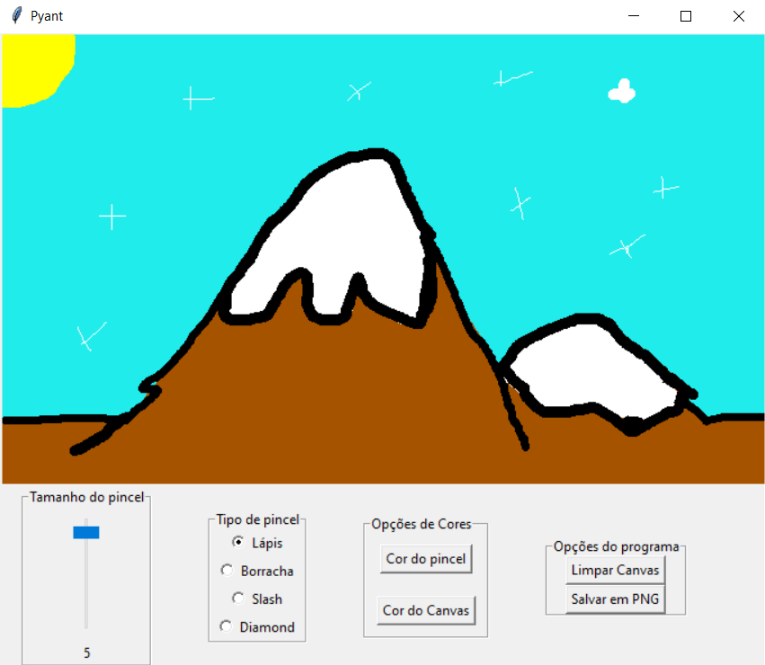

# Pyant (Python+Paint)

## Tecnologias

Esse projeto foi desenvolvido com as seguintes tecnologias:

- [Python](https://www.python.org/)
- [Tkinter](https://docs.python.org/3/library/tkinter.html)
- [Pillow](https://pillow.readthedocs.io/en/stable/)

## Projeto

 Aplicativo simples de desenho com inspiração no software Paint da Microsoft. Projeto feito com a intenção de exercitar os conhecimentos de POO e GUI com python.

## Licença

Esse projeto está sob a licença MIT. Veja o arquivo [LICENSE](LICENSE.md) para mais detalhes